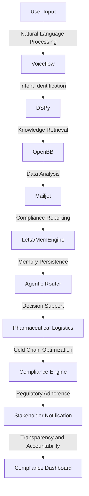

# Agentic Cold Chain Compliance Engine
> Orchestrating a symphony of artificial intelligence, cognitive architectures, and pharmaceutical logistics to ensure the integrity of temperature-sensitive medicinal products throughout the supply chain lifecycle.

## 🏗️ Technical Architecture & Multi-Agent Flow

The technical architecture of the Agentic Cold Chain Compliance Engine is a complex interplay of multiple agents, each with its own specialized capabilities. The Voiceflow module handles user input and intent identification, while the DSPy module facilitates knowledge retrieval and data analysis. The OpenBB module provides real-time data analysis and insights, which are then used by the Mailjet module to generate compliance reports. The Letta/MemEngine module ensures memory persistence and decision support, which are critical components of the agentic router. The agentic router, in turn, enables the pharmaceutical logistics module to optimize cold chain operations and ensure regulatory adherence.

## 🔍 The Vertical Bottleneck: Pharmaceutical Cold Chain Compliance
The pharmaceutical industry is plagued by a multitude of challenges, including the need to maintain precise temperature control throughout the supply chain lifecycle. The consequences of non-compliance can be severe, resulting in compromised product efficacy, patient safety risks, and significant financial losses. The technical friction associated with cold chain compliance is further exacerbated by the complexity of regulatory requirements, the need for real-time monitoring and reporting, and the lack of standardized protocols for data exchange and analysis. The high-stakes mathematical and operational failures that can occur in this context necessitate the development of sophisticated, AI-driven solutions that can navigate the intricacies of cold chain logistics and ensure compliance with regulatory requirements.

The vertical bottleneck in pharmaceutical cold chain compliance is characterized by a lack of visibility, transparency, and accountability throughout the supply chain lifecycle. The absence of standardized protocols for data exchange and analysis creates a technical friction that hinders the ability of stakeholders to make informed decisions and respond to emerging trends and patterns. The consequences of non-compliance can be severe, resulting in compromised product efficacy, patient safety risks, and significant financial losses. The need for real-time monitoring and reporting, combined with the complexity of regulatory requirements, creates a high-stakes environment that demands the development of sophisticated, AI-driven solutions.

The technical challenges associated with pharmaceutical cold chain compliance are further complicated by the need to integrate multiple systems, protocols, and stakeholders. The lack of standardized protocols for data exchange and analysis creates a technical friction that hinders the ability of stakeholders to make informed decisions and respond to emerging trends and patterns. The consequences of non-compliance can be severe, resulting in compromised product efficacy, patient safety risks, and significant financial losses. The need for real-time monitoring and reporting, combined with the complexity of regulatory requirements, creates a high-stakes environment that demands the development of sophisticated, AI-driven solutions.

## 💡 The Solution: Agentic Cold Chain Compliance Engine
The Agentic Cold Chain Compliance Engine is a revolutionary solution that orchestrates the capabilities of Voiceflow, DSPy, OpenBB, and Mailjet to ensure compliance with regulatory requirements and optimize cold chain operations. The engine's agentic reasoning capabilities enable it to navigate the intricacies of cold chain logistics, identify potential risks and vulnerabilities, and provide real-time recommendations for mitigation and remediation. The engine's memory usage and persistence capabilities ensure that critical data and insights are retained and leveraged to inform decision-making and drive continuous improvement.

The Agentic Cold Chain Compliance Engine is designed to integrate seamlessly with existing systems and protocols, providing a standardized framework for data exchange and analysis. The engine's vision and robotics integration capabilities enable it to leverage real-time data from sensors, cameras, and other sources to monitor and analyze cold chain operations. The engine's capabilities are further enhanced by its ability to learn from experience and adapt to emerging trends and patterns, ensuring that it remains a cutting-edge solution for pharmaceutical cold chain compliance.

## 🧩 Agentic Stack Deep-Dive
The Agentic Cold Chain Compliance Engine is built on a foundation of cutting-edge technologies, including Voiceflow, DSPy, OpenBB, and Mailjet. Voiceflow provides the engine's natural language processing and intent identification capabilities, while DSPy facilitates knowledge retrieval and data analysis. OpenBB provides real-time data analysis and insights, which are then used by Mailjet to generate compliance reports. The engine's agentic reasoning capabilities are enabled by the integration of these technologies, which provides a comprehensive framework for decision-making and continuous improvement.

The integration of Voiceflow and DSPy enables the engine to leverage the capabilities of both technologies, providing a powerful framework for natural language processing and knowledge retrieval. The integration of OpenBB and Mailjet enables the engine to leverage real-time data analysis and insights, providing a comprehensive framework for compliance reporting and regulatory adherence. The engine's agentic reasoning capabilities are further enhanced by its ability to learn from experience and adapt to emerging trends and patterns, ensuring that it remains a cutting-edge solution for pharmaceutical cold chain compliance.

## ✨ Capabilities & Features
* **Natural Language Processing**: The engine's natural language processing capabilities enable it to understand and interpret user input, providing a intuitive and user-friendly interface for stakeholders.
* **Intent Identification**: The engine's intent identification capabilities enable it to identify the intent behind user input, providing a framework for decision-making and continuous improvement.
* **Knowledge Retrieval**: The engine's knowledge retrieval capabilities enable it to leverage critical data and insights from a variety of sources, providing a comprehensive framework for decision-making and continuous improvement.
* **Data Analysis**: The engine's data analysis capabilities enable it to provide real-time insights and recommendations for mitigation and remediation, ensuring that stakeholders can make informed decisions and respond to emerging trends and patterns.
* **Compliance Reporting**: The engine's compliance reporting capabilities enable it to generate comprehensive reports and alerts, ensuring that stakeholders are informed and aware of potential risks and vulnerabilities.
* **Memory Persistence**: The engine's memory persistence capabilities enable it to retain critical data and insights, providing a framework for decision-making and continuous improvement.
* **Agentic Reasoning**: The engine's agentic reasoning capabilities enable it to navigate the intricacies of cold chain logistics, identify potential risks and vulnerabilities, and provide real-time recommendations for mitigation and remediation.
* **Vision and Robotics Integration**: The engine's vision and robotics integration capabilities enable it to leverage real-time data from sensors, cameras, and other sources to monitor and analyze cold chain operations.
* **Real-Time Monitoring**: The engine's real-time monitoring capabilities enable it to provide stakeholders with real-time insights and alerts, ensuring that they can respond to emerging trends and patterns.
* **Regulatory Adherence**: The engine's regulatory adherence capabilities enable it to ensure compliance with regulatory requirements, providing a framework for decision-making and continuous improvement.

## 🛠️ Technical Implementation
The technical implementation of the Agentic Cold Chain Compliance Engine is a complex process that requires the integration of multiple technologies and protocols. The engine's natural language processing and intent identification capabilities are enabled by the integration of Voiceflow and DSPy, while the engine's knowledge retrieval and data analysis capabilities are enabled by the integration of OpenBB and Mailjet. The engine's agentic reasoning capabilities are enabled by the integration of these technologies, which provides a comprehensive framework for decision-making and continuous improvement.

The engine's technical implementation is further complicated by the need to integrate multiple systems and protocols, including sensors, cameras, and other sources of real-time data. The engine's vision and robotics integration capabilities enable it to leverage this data, providing a comprehensive framework for monitoring and analyzing cold chain operations. The engine's real-time monitoring and regulatory adherence capabilities are further enhanced by its ability to learn from experience and adapt to emerging trends and patterns, ensuring that it remains a cutting-edge solution for pharmaceutical cold chain compliance.

## 📊 Business Impact & ROI
The Agentic Cold Chain Compliance Engine has the potential to drive significant business impact and return on investment (ROI) for pharmaceutical companies. By ensuring compliance with regulatory requirements and optimizing cold chain operations, the engine can help companies reduce the risk of product recalls, improve patient safety, and minimize financial losses. The engine's real-time monitoring and analytics capabilities can also help companies identify areas for improvement and optimize their supply chain operations, leading to increased efficiency and reduced costs.

The engine's agentic reasoning capabilities can also help companies identify potential risks and vulnerabilities, providing a framework for decision-making and continuous improvement. The engine's vision and robotics integration capabilities can also help companies leverage real-time data from sensors, cameras, and other sources, providing a comprehensive framework for monitoring and analyzing cold chain operations. The engine's regulatory adherence capabilities can also help companies ensure compliance with regulatory requirements, providing a framework for decision-making and continuous improvement.

## 🚀 Getting Started
```bash
git clone https://github.com/arvind-sundararajan/pharma-cold-chain-compliance.git
cd pharma-cold-chain-compliance
pip install -r requirements.txt
python src/main.py
```

## 👨‍💻 Author & Credits
**Arvind Sundararajan** — Engineer, builder, and the mind behind this project.
🌐 [LinkedIn](https://www.linkedin.com/in/arvind-sundara-rajan/) | Chennai, India

---
### 🙏 Acknowledgements
- The open-source community
- The Pharmaceuticals practitioners who inspired this design